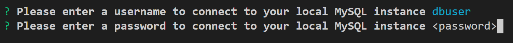
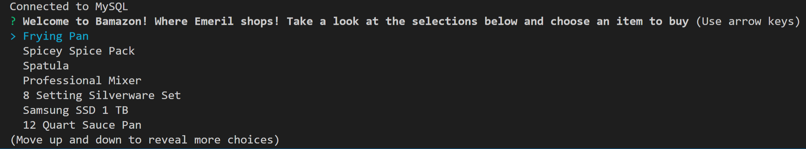

# bamazon

## Overview:
What is BAMazon you ask? Some say it is simply a knock-off on Amazon  for use by students to learn MySQL by reading and setting data via a pseudo-store front. By I have it on good authority that BAMazon is actually where Emeril Lagassi shops for his restaurants.

This application runs on node and uses the "mysql" and "inquirer" packages to provide the backend and UI. This application is the customer facing portion which provides a store-front for users to shop for food related items. The user will be presented with a list of 10 items available for purchase, they will select the item and enter the amout to purchase. If there is enough of that item in stock, they will be allowed to proceed with the purchase. If there are not enough items in stock, the user will be notified and allowed to adjust the amount they would like to purchase.

## Setup Instructions:

### Node Setup:
* Clone the repository to your local drive (https://github.com/levicrouch/bamazon.git "bamazon repository")
* Node must be installed, 8.9.4 or greater - (https://nodejs.org/en/download/ "Node download page")
* From the command-line install the dependent packages via the following command:
    * <pre><code>npm install</pre><code>
* Execute the application:
    * <pre><code>node bamazonCustomer.js</pre></code>

### MySQL Setup:
* Install MySQL server (https://www.mysql.com/downloads/ "MySQL Downloads")
* From your MySQL client application -or- MySQL Workbench, open bamazon.sql
* Execute the SQL script to create the database, table, columns and row data for the application
* Verify installation by executing:
    * <pre><code>USE bamazon;
    * SELECT * FROM products;</pre></code>

## Application Usage:
* Once <pre><code>node bamazonCustomer.js</pre></code> has been executed, the user will be prompted to enter a username and password to connect to their local MySQL instance.
    * 
* Once connected to the local MySQL instance, the user is presented with a list of items for purchase.
    * 
* The user will move the arrow key up and and down to select the item they wish to purchase
* Press enter to choose a given item
* The user is then prompted